[license-image]: https://img.shields.io/badge/License-MIT-blue.svg
[license-url]: https://opensource.org/licenses/MIT
[pypi-image]: https://badge.fury.io/py/python-profeld.svg
[pypi-url]: https://pypi.python.org/pypi/python-profeld
[build-image]: https://github.com/LongxingTan/python-profeld/actions/workflows/test.yml/badge.svg?branch=master
[build-url]: https://github.com/LongxingTan/python-profeld/actions/workflows/test.yml?query=branch%3Amaster
[lint-image]: https://github.com/LongxingTan/python-profeld/actions/workflows/lint.yml/badge.svg
[lint-url]: https://github.com/LongxingTan/python-profeld/actions/workflows/lint.yml
[docs-image]: https://readthedocs.org/projects/python-profeld/badge/?version=latest
[docs-url]: https://python-profeld.readthedocs.io/en/latest/

<h1 align="center">

</h1><br>

[![LICENSE][license-image]][license-url]
[![PyPI Version][pypi-image]][pypi-url]
[![Build Status][build-image]][build-url]
[![Lint Status][lint-image]][lint-url]
[![Docs Status][docs-image]][docs-url]

**[Documentation](https://python-profeld.readthedocs.io)** | **[Tutorials](https://python-profeld.readthedocs.io/en/latest/tutorials.html)** | **[Release Notes](https://python-profeld.readthedocs.io/en/latest/CHANGELOG.html)** | **[中文](./README_CN.md)**

**python-profeld** is a python library for survival analysis and predictive maintenance. It's named after and inspired by the reliability software I used in Daimler, but python-profeld is more powerful.

## Tutorial

### Installation

```shell
$ pip install profeld
```

### Usage

```python
import profeld


```

## Examples

```python

```

## Acknowledgements

Survival analysis, is important for me. This is where my career started, after graduation I joined Mercedes and worked as a pioneer in automotive field quality. It's still a dream time to work together with Dr. Andreas Jacobi and Christoph Jordan to predict the vehicle performance, and we really made a difference with ProFeld and helped Mercedes customers to have a better product. (Even so, I can never afford one, just like thousand years ago the Chinese poet said: 遍身罗绮者，不是养蚕人)

After that, I continue implementing predictive maintenance applications for industry until 2023. Cheers for the great time! It's nice to share some tutorials and insights here, just like they once taught me since my first working day in Beijing and Stuttgart. I consider this repo as a witness of the pleasant time we spent together. May this repo also bring my regards to Ling, Bolin, Haihang, Yi, Fanny, Frank, Qing, Yiren, Kim, Rui, Lankai, Lei, Prof Luy, the whole Stuttgart Reliability team, and Beijing QFS team.
